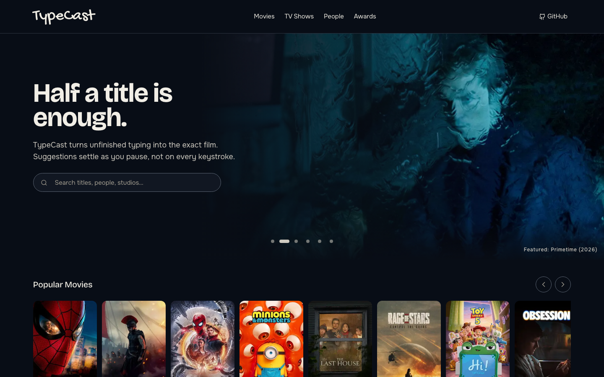
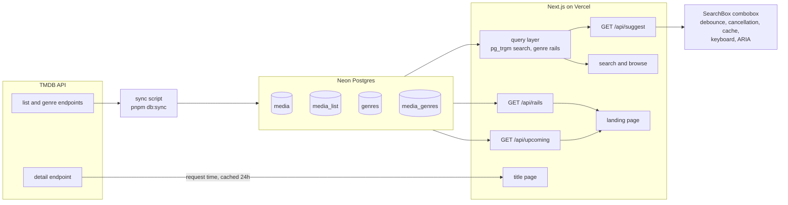

# TypeCast

Search-as-you-type, built by hand. Movies are the demo domain; the
autocomplete is the deliverable.

**Live at [typecast-sepia.vercel.app](https://typecast-sepia.vercel.app)**

## About

TypeCast is a full-stack learning project built around one question:
what does it take to make search-as-you-type feel instant, correct,
and accessible, without reaching for a library that already knows?

The efficiency stack is written from scratch on purpose. The combobox
debounces trailing keystrokes at 200ms, cancels in-flight requests
with an `AbortController` the moment a newer keystroke lands, and
serves repeats synchronously from a client-side cache keyed by the
normalized query. Keyboard navigation and the full WAI-ARIA combobox
pattern are implemented by hand: `role="combobox"` with
`aria-activedescendant`, a listbox of options, a polite live region
announcing result counts, and ArrowUp, ArrowDown, Enter, and Escape
doing exactly what the pattern says they should. An empty, focused
field offers recent searches from `localStorage`.

Matching and ranking happen in Postgres, not in the client. The
catalog is synced from TMDB into Neon, where a normalized search
column carries a `pg_trgm` GIN index. Short fragments use a prefix
scan; three characters and up rank by exact-prefix first, then
`word_similarity()` descending, then popularity. The suggest endpoint
and the results page share one query, so both surfaces always agree.

The catalog pages browse the same data by genre: one SQL statement
ranks every rail for a page with a window function, capped at twenty
titles per rail, in a curated order.

## Architecture

The sync script pulls TMDB's trending, category, and genre endpoints
and upserts four tables. The Neon HTTP driver has no transactions, so
list and genre memberships are replaced upsert-then-prune: each
statement is atomic on its own, and readers never see an empty set
mid-sync. The title page is the one surface that talks to TMDB at
request time, one appended request per title, cached for a day.

## Tech stack

- **Framework:** Next.js 16 (App Router, Route Handlers), React 19
  with the React Compiler, TypeScript strict
- **Database:** Neon Postgres over the serverless HTTP driver, Drizzle
  ORM, Drizzle Kit migrations, `pg_trgm`
- **Styling:** hand-written CSS; design tokens in `oklch`, BEM with
  native nesting, no component library
- **Testing:** Playwright end-to-end (Chromium, Firefox, WebKit in CI)
- **Quality:** Biome for lint and format, `tsc --noEmit`, GitHub
  Actions CI with Lighthouse score budgets against production
- **Tooling:** pnpm, tsx for the sync script
- **Hosting:** Vercel, zero-config

Deliberately absent: data-fetching libraries, component libraries, and
paid tiers. Debounce, cancellation, caching, keyboard handling, and
ARIA are the project, so no dependency is allowed to provide them.

## Accessibility

Accessibility is a design input, not a retrofit:

- The combobox follows the WAI-ARIA pattern with focus held in the
  input and `aria-activedescendant` tracking the highlighted option.
- A visually hidden live region announces suggestion counts politely.
- Every page has landmarks, a skip link, and a single `h1`.
- Focus rings are `outline`-based, so they survive forced-colors mode.
- `prefers-reduced-motion` stops the caret blink and smooth scrolling.
- Contrast pairs are chosen against WCAG thresholds.

## Design system

One fluid layout system spaces every page: a single container whose
cap and gutter scale with the viewport as proportions and clamps, not
stepped breakpoints, so resizing moves in one motion. Hero bands scale
with the width. The site ships a single dark palette.

## Status

The core is live: the hand-built combobox, the local catalog with
genre rails on the browse pages, and the landing, search, and title
pages. On the roadmap: combobox loading and error states, rate
limiting, a scheduled sync, unit tests, and People and Awards
content.

## Attribution

This product uses the TMDB API but is not endorsed or certified by
TMDB.

## Disclaimer

This project is provided for demonstration and portfolio purposes. It
is supplied as is, without warranty of any kind, express or implied.
No guarantee is made regarding accuracy, availability, or fitness for
any particular purpose. Use at your own risk.

TMDB data is used under TMDB's non-commercial terms. This project is
not affiliated with TMDB.

## Intellectual Property

Copyright (c) 2026 Sauel Almonte. All rights reserved.

This repository is **not** open source. No license is granted to any
person to use, copy, modify, merge, publish, distribute, sublicense,
or sell any portion of this software.

The source code, architecture, design, and documentation contained in
this repository are the intellectual property of the author. Viewing
this repository for evaluation purposes does not confer any rights to
its contents.

Unauthorized use, reproduction, or derivative work is prohibited.
